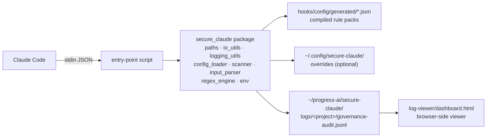
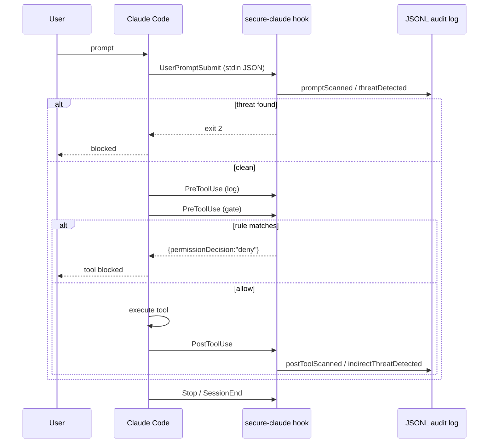

# Architecture

## Component diagram

## Data flow

1. Claude Code fires a hook event and writes JSON to the script's stdin.
2. The thin entry-point script reads stdin and delegates to the `secure_claude` package.
3. Rules are loaded from compiled JSON under `hooks/config/generated/` (plus optional local overrides).
4. On a match, a JSONL record is appended to the audit log. For `PreToolUse`, a
   `hookSpecificOutput.permissionDecision: "deny"` payload is written to stdout to block the call.
5. The dashboard loads the JSONL file client-side — drag-drop, fully browser-local.

## Hook lifecycle

## Naming convention

| Prefix | Role | Example |
|--------|------|---------|
| `log_*` | Audit record only — never modifies behavior | `log_session_start.py` |
| `scan_*` | Inspect content + log findings, may exit 2 | `scan_prompt_injection.py` |
| `gate_*` | Enforce deny decisions via stdout JSON | `gate_pre_tool_use.py` |

## Enforcement vs. observability

Only `gate_pre_tool_use` can truly prevent a tool from running. Other scanners produce
audit records and can exit with non-zero codes, but Claude Code's tool lifecycle treats
those as observability signals.

| Hook event | Mechanism | Blocks execution? |
|-----------|-----------|-------------------|
| `UserPromptSubmit` | exit 2 + stderr message | ✅ Claude Code blocks the prompt |
| `PreToolUse` (gate) | `permissionDecision: "deny"` JSON | ✅ primary enforcement |
| `PostToolUse` | audit record, non-zero exit | ❌ cannot undo a completed tool call |
| All others | audit record only | ❌ observability only |

## Shared package layout

Each hook entry script is ~20 lines — all real work lives in `secure_claude/`:

| Module | Responsibility |
|--------|----------------|
| `paths` | Resolve plugin root, project name, log paths |
| `io_utils` | stdin/stdout JSON, JSONL append, UTC timestamps |
| `logging_utils` | `audit_log`, `config_error`, `ui_print` |
| `regex_engine` | Unified POSIX/PCRE → Python `re` compiler |
| `config_loader` | Shipped + override merge with fail-closed semantics |
| `input_parser` | Normalize Claude Code tool-event payloads |
| `scanner` | Rule-matching with evidence capture |
| `env` | Environment flag resolution (`SKIP_GOVERNANCE_AUDIT`) |

## Fail-closed vs. fail-open

| Layer | On config failure | Reason |
|-------|-------------------|--------|
| Gate (`gate_pre_tool_use`) | **Deny all tool calls** | Enforcement must not silently degrade |
| Scanners (`scan_*`) | Skip scan, exit 0 | Breaking a user's workflow on audit failure is worse than a missed scan |
| Loggers (`log_*`) | Log `configError`, exit 0 | Observability must never block the session |
